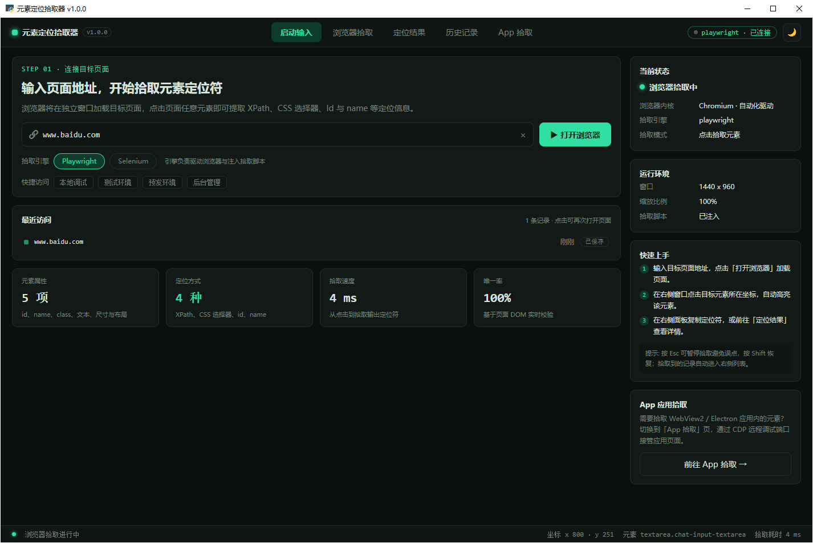
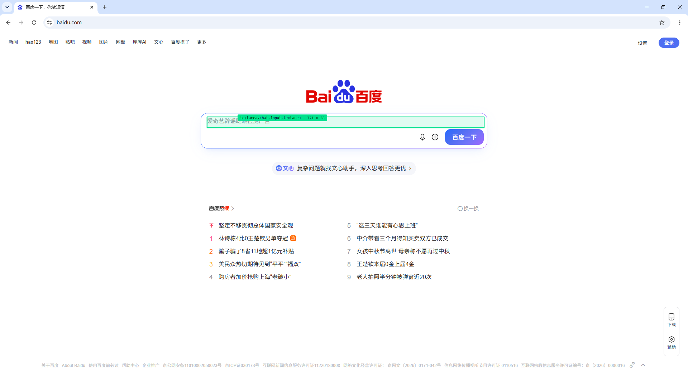
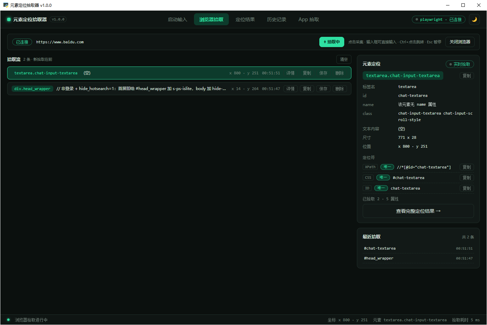
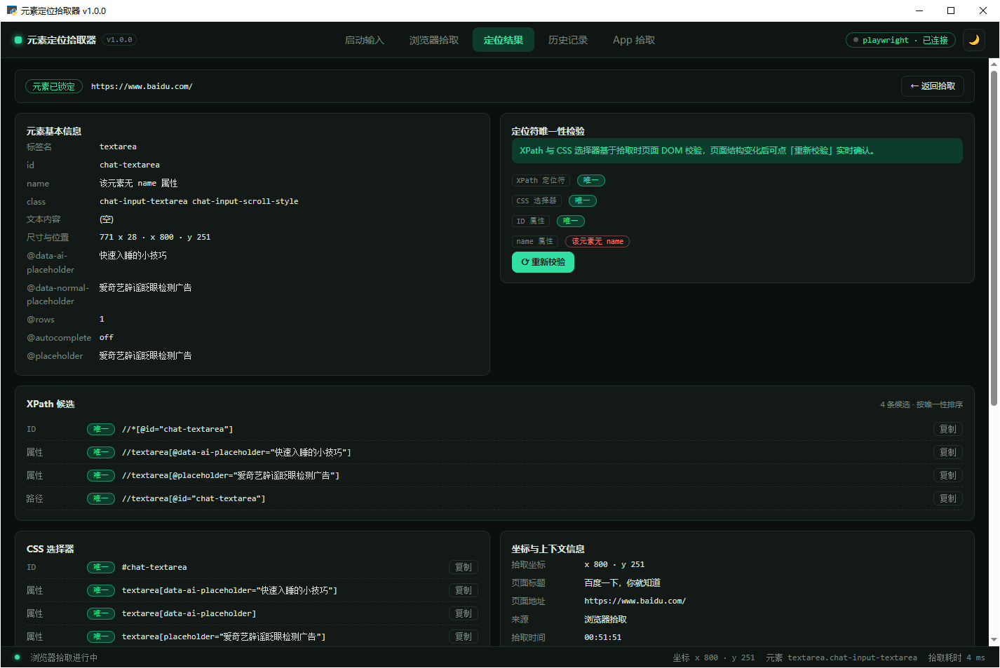
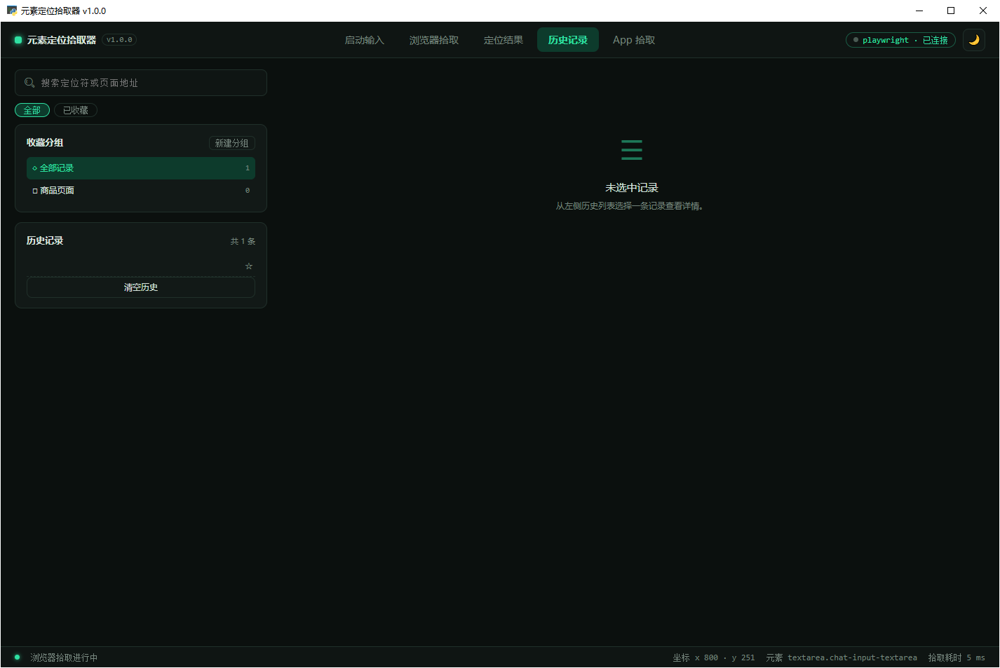
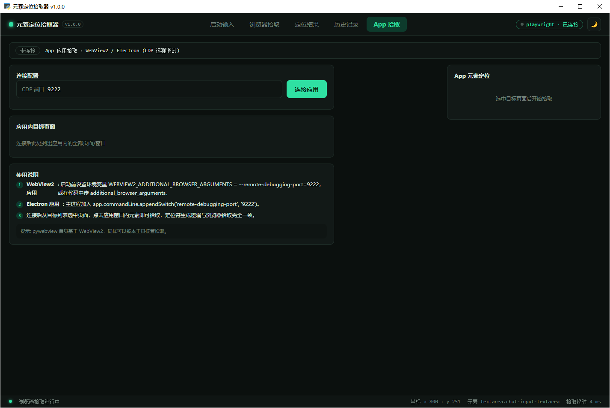

# ElementPicker 元素定位拾取器

> 桌面端 Web 元素定位拾取工具：悬停高亮、点击采集，自动生成 40+ 种 XPath / CSS 定位符候选并实测唯一性，支持 WebView2 / Electron 应用内页面拾取。

深色 / 浅色双主题，内置 Chromium，**下载解压即用，目标机零环境**。



## 功能一览

**浏览器拾取**

- 独立浏览器窗口加载目标页面，鼠标悬停绿色高亮框 + 提示标签（标签名 / class / 尺寸），点击即完成一次拾取
- **拾取 / 浏览双模式**：拾取模式点击采集定位符；浏览模式完全放行，可正常点链接、翻页面导航，模式跨页面自动继承
- **浏览器可选**：默认 Edge，可切换 Chrome；所选浏览器没装时自动回退另一个，都没有则 Playwright 引擎自动下载 Chromium（联网一次，无需目标机 Python）
- **新标签页自动跟随**：拾取模式下点击链接新开标签页会自动切过去继续拾取，关掉后自动回退
- 输入框可直接输入：点击输入类元素「采集 + 放行」，定位符照记、搜索框照常打字
- `Ctrl+点击` 临时穿透跳转，`Esc` 暂停 / `Shift` 恢复
- 拾取流实时列表，点选任意一条右侧面板即时联动，支持单条删除 / 清空 / 收藏
- 快捷访问地址可编辑（本地持久化），启动页一键填入常用环境





**定位结果**

- XPath / CSS 选择器候选丰富：ID、NAME、属性精确与 `^=`/`$=`/`*=` 运算符、多属性组合、类名全组合 / 两两组合 / 无标签组合、结构路径、祖先 ID / 类名锚定（如 `.el-row > div:nth-child(1) .total-value`）、`nth-of-type`
- 文本定位全家族：`//tag[text()="…"]`、`//*[text()="…"]`、`(//*[text()="…"])[1]`、`normalize-space(text())`、`//tag[contains(text(),"…")]`，与 XPath `text()` 语义严格对齐（只取直接文本节点）
- 每条候选**实时实测页内匹配数**，唯一 / 多匹配 / 不可用徽章一目了然，页面结构变化后可随时重新校验
- Selenium / Playwright / Cypress 三种代码片段一键生成、一键复制
- 超长定位符（如巨型 JSON 属性选择器）点击展开 / 收起，不再撑爆布局



**历史记录**

- 本地 JSON 落库，搜索（标签 / 定位符 / 文本）、收藏（★）、自定义分组
- 详情回看：基本信息、全部候选、坐标与页面上下文
- 导出 JSON



**App 拾取（WebView2 / Electron）**

- 通过 CDP 远程调试端口接管应用内全部页面 / 窗口，枚举后点选拾取
- 定位符生成逻辑与浏览器拾取完全一致
- 页面内附 WebView2 / Electron 开启远程调试端口的说明



**其他**

- 深色 / 浅色主题一键切换，选择持久化
- 拾取统计卡：元素属性数、定位方式、拾取速率、唯一率
- 应用窗口关闭时自动回收浏览器进程，不残留

## 下载运行

从 [Releases](../../releases) 下载对应平台的包：

| 系统 | 下载 | 体积（zip） | 说明 |
|---|---|---|---|
| Windows 完整版 | `element_picker_v*_win64.zip` | ~364MB（解压 ~843MB） | 内置 Chromium，解压双击 `element_picker.exe` |
| Windows 轻量版 | `element_picker_v*_win64_lite.zip` | ~67MB（解压 ~168MB） | 不内置浏览器，默认用系统 Edge，可切换 Chrome |
| macOS 完整版 (Apple Silicon / Intel) | `*_macos_arm64` / `*_macos_x86_64` 的 `.dmg` 或 `.zip` | ~300~360MB | 内置 macOS 版 Chromium，dmg 拖进 Applications |
| macOS 轻量版 | 同架构 `*_lite.zip` | ~55~65MB | 不内置浏览器，逻辑同 Windows Lite |

- 完整包**已内置 Chromium**，解压即用、目标机零环境；Lite 包体积约为完整版的 1/5，若目标机既无 Edge 也无 Chrome，Playwright 引擎会**自动下载 Chromium**（~150MB，联网一次，之后走本地缓存，无需目标机安装 Python）
- 浏览器可在界面「启动输入」页选择（默认 Edge，可选 Chrome）；拾取模式下点击链接新开标签页会**自动跟随**，新页面可继续拾取
- Selenium 引擎自带 Selenium Manager（已打包内置），首次使用自动下载匹配版本的浏览器驱动（需联网一次，之后走本地缓存）
- macOS 首次打开若提示「无法验证开发者」：右键 -> 打开（仅一次）；若提示「已损坏」：终端执行 `xattr -cr element_picker.app`

## 从源码运行

```bash
pip install -r requirements.txt
python -m playwright install chromium
python app.py
```

界面基于 **H5 + CSS + JavaScript** 构建，第三方前端依赖（LayUI / Petite-Vue）已全部本地化，运行不依赖外网。

## 打包与 CI

- 本地打包：Windows `python build_win.py`（加 `--lite` 出轻量版）；macOS `./build_mac.sh --dmg`（加 `--lite` 出轻量版；需在 macOS 上执行，PyInstaller 不支持交叉编译）
- CI：push 到 `main` 自动触发 [release.yml](.github/workflows/release.yml)——Windows + macOS 双架构出包并发预发布 Release；手动打 `v*` tag 则发正式 Release
- 版本号自动递增（`ci_version.sh`）：每次 push 取最新 tag patch +1，应用内显示 / 产物文件名 / Release tag 全部同源
- 只想单独出 mac 包：Actions 页手动运行 [Build macOS App](.github/workflows/build-mac.yml)

## 定位符候选速查

| 类别 | 示例 |
|---|---|
| ID / NAME | `//*[@id="chat-textarea"]` / `//input[@name="keyword"]` |
| 属性精确 | `a[data-sku="A1024"]` |
| 属性运算符 | `a[href^="/product/d"]`、`a[data-sku$="26-0888"]`、`a[data-sku*="-2026-"]` |
| 类名组合 | `a.product-title.promo-item`、`.product-title.promo-item.j-track` |
| 结构路径 | `li.product-card > a.product-title`、`#main > button.btn-checkout` |
| 祖先锚定 | `.el-row > div:nth-child(1) .total-value` |
| 文本精确 | `//a[text()="下一步，选择商品关联"]`、`(//*[text()="…"])[1]` |
| 文本包含 | `//span[contains(text(),"删除")]`、`//*[contains(text(),"…")]` |

## License

MIT
